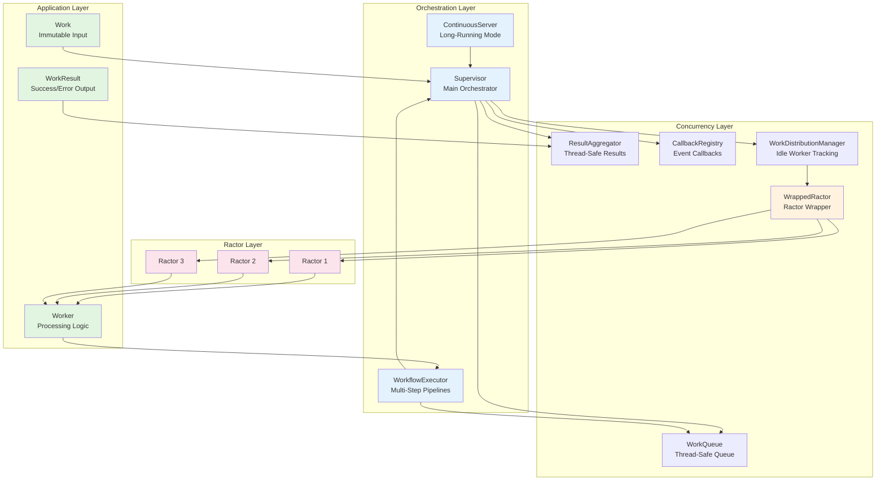
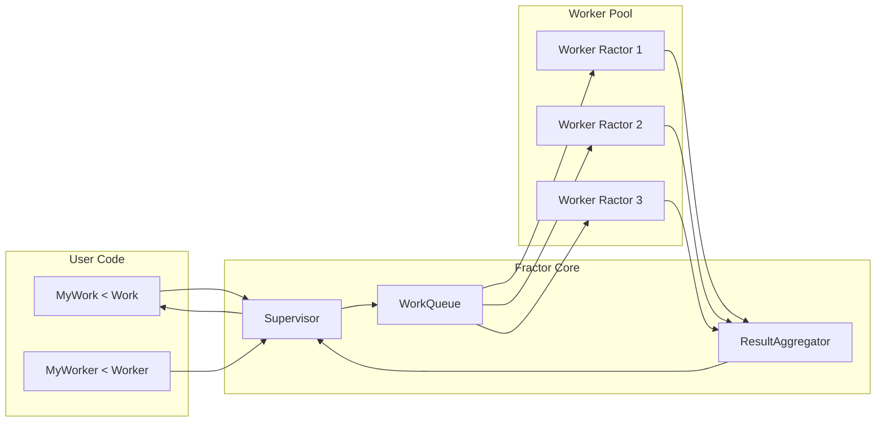
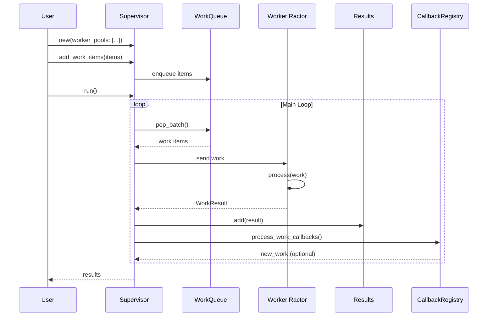
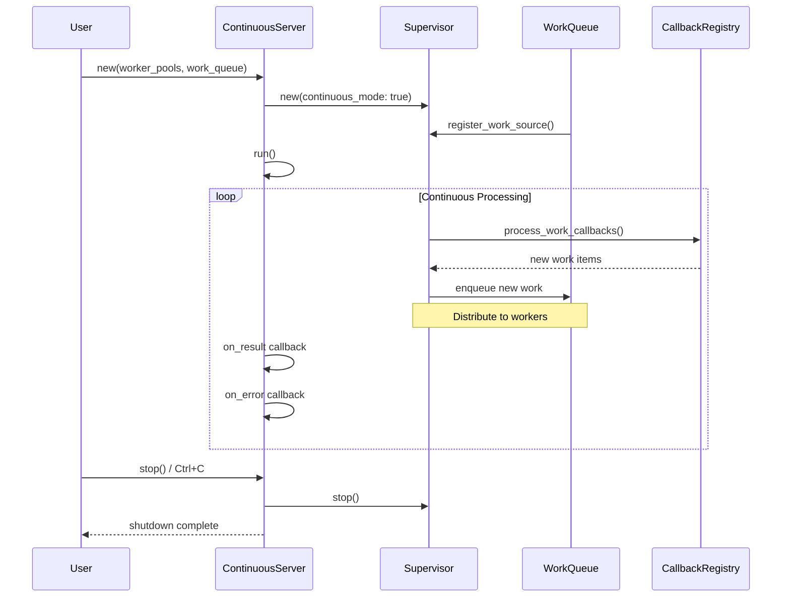
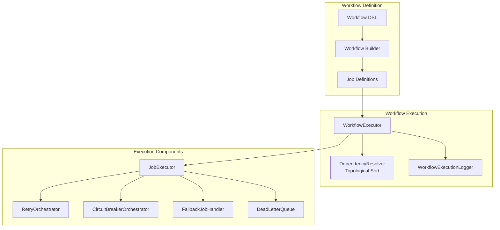
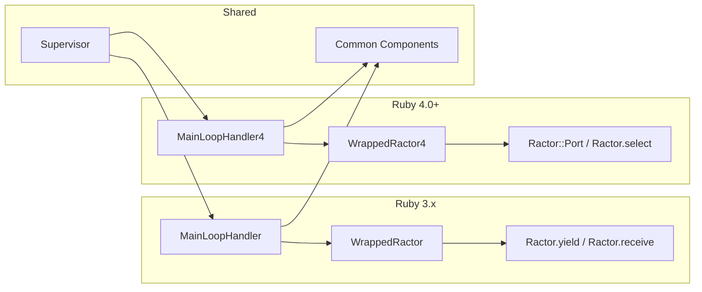
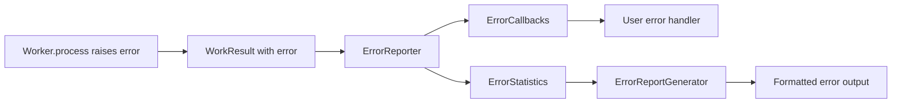

# Fractor Architecture

This document provides architecture diagrams and descriptions of the Fractor framework's components.

## Overview

Fractor is a function-driven Ractors framework for Ruby that provides true parallelism using Ruby's Ractor feature with automatic work distribution across isolated workers.

## High-Level Architecture

## Component Relationships

## Pipeline Mode Execution Flow

## Continuous Mode Execution Flow

## Workflow System Architecture

## Ruby Version-Specific Architecture

## Component Responsibilities

### Application Layer

| Component | Responsibility |
|-----------|---------------|
| **Work** | Immutable data container with input data |
| **Worker** | Processing logic with `process(work)` method |
| **WorkResult** | Contains success/failure status, result value, or error |

### Orchestration Layer

| Component | Responsibility |
|-----------|---------------|
| **Supervisor** | Main orchestrator for pipeline mode, manages worker lifecycle |
| **ContinuousServer** | High-level wrapper for long-running services |
| **WorkflowExecutor** | Orchestrates multi-step workflow executions |

### Concurrency Layer

| Component | Responsibility |
|-----------|---------------|
| **WorkQueue** | Thread-safe queue for work items |
| **ResultAggregator** | Thread-safe result collection with event notifications |
| **CallbackRegistry** | Manages work source and error callbacks |
| **WrappedRactor** | Safe wrapper around Ruby Ractor with version-specific implementations |
| **WorkDistributionManager** | Tracks idle workers and distributes work efficiently |

### Ractor Layer

| Component | Responsibility |
|-----------|---------------|
| **Ractor 1, 2, 3...** | Isolated Ruby Ractors containing Worker instances |
| **Worker instances** | Each Ractor has its own Worker instance for processing |

## Data Flow

### Work Processing Flow

### Error Handling Flow

## Key Design Principles

1. **Function-Driven**: Work is defined as input → processing → output
2. **Message Passing**: Ractors communicate via messages, no shared state
3. **Immutability**: Work objects are immutable, ensuring thread safety
4. **Isolation**: Each Worker runs in its own Ractor with isolated memory
5. **Scalability**: Automatically distribute work across available workers
6. **Fault Tolerance**: Errors are captured without crashing other workers
7. **Version Compatibility**: Separate implementations for Ruby 3.x and 4.0+
